  

  <h1>Hi, I'm Chenyang 🐚</h1>

  

  

    
    
    
    
  

## About me

I build open-source infrastructure where people and AI agents work together. I am currently building **Tutti**, a real-time shared workspace that connects context, files, apps, and tasks across agents.

- 🐚 Building [Tutti](https://github.com/tutti-os/tutti) — where people and agents build in tune.
- 🤖 Exploring multi-agent collaboration, Agent lifecycles, and developer tools.
- 🚀 Shipping open-source and full-stack products from **Nexight · Shenzhen**.

## Featured open source

### 🟣 [Tutti](https://github.com/tutti-os/tutti) · [Website](https://tutti.sh/zh)

> **Where people and agents build in tune.**

Tutti is a real-time shared workspace where people and AI agents work with connected context, files, apps, and tasks. Codex, Claude Code, and other agents can build on one another's output without turning the human into a messenger between isolated tools.

  
  
  

### 🔵 [CampusX](https://github.com/daniel20060210/CampusX-wx)

A full campus product spanning a native WeChat Mini Program, a Vue 3 administration console, and Spring Boot services. It covers social content, a second-hand marketplace, errands, teacher ratings, real-time chat, governance, and operational workflows.

Also exploring quantitative multi-agent workflows in <a href="https://github.com/daniel20060210/Quant_Agents">Quant_Agents</a>.

## What I work with

- **Agent Infrastructure** — TypeScript · Python · Codex · Claude
- **Frontend** — React · Vue · WeChat Mini Program
- **Backend** — Node.js · Java · Spring Boot
- **Infrastructure** — Docker · GitHub Actions · MySQL · Redis

  

## GitHub activity

  
  

Statistics above reflect public repositories and may be cached by the card provider.

<picture>
  <source media="(prefers-color-scheme: dark)" srcset="https://raw.githubusercontent.com/daniel20060210/daniel20060210/output/github-contribution-grid-snake-dark.svg" />
  <source media="(prefers-color-scheme: light)" srcset="https://raw.githubusercontent.com/daniel20060210/daniel20060210/output/github-contribution-grid-snake.svg" />
  
</picture>

### Let's build the future of human-agent collaboration.

